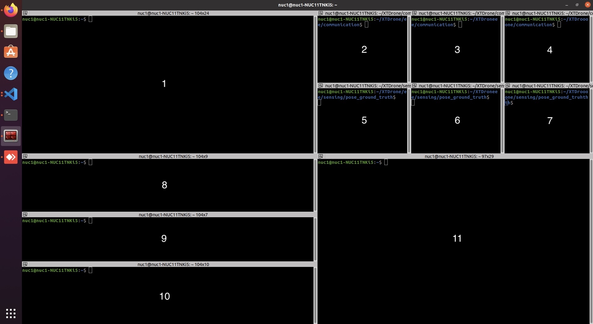

# mlabteam-forest

## 0. Видео демонстрирующие выполнение миссии
- [Выполнение миссии](https://disk.yandex.ru/i/Ezrg56YmDXLcKA)
- [Процедура запуска](https://disk.yandex.ru/i/zDvLoZwLS5xmXw)

## 1. Используемые в проекте репозитории

- [Fast-Drone-250-v2](https://github.com/ZJU-FAST-Lab/Fast-Drone-250-v2)

## 2. Используемое в проекте оборудование

- **Бортовой компьютер:** Intel NUC11TNKi5000 
- **SSD:** Samsung SSD 970 EVO 1TB (MZ-V7E1T0) — 1 шт.  
- **ОЗУ:** Micron Technology MTA8ATF1G64HZ-3G2E1 8GB — 2 шт.  
- **ОС:** Linux Ubuntu 22.04  

---

## 3. Алгоритм установки

1. Скачайте файл [`XTDRone_Installer_13_3.1.zip`](https://disk.yandex.ru/d/Jgix8lvp-Q6Ufg), распакуйте его и переместите в домашнюю директорию:
   ```bash
   mv XTDRone_Installer_13_3.1 ~/XTDRone_Installer_13_3.1
   ```

2. Установка XTDrone:
   - Перейдите в директорию:
      ```bash
      cd ~/XTDRone_Installer_13_3.1
      ```
   - Если у вас уже установлена ROS:
     ```bash
     ./setup-without-ros.sh
     ```
   - Если ROS не установлена:
     ```bash
     ./setup.sh
     ```
   **Важно:** *Не используйте `sudo` при запуске этих скриптов.*

3. Скачайте файлы `multi_vehicle.launch`, `forest_3.world` и переместите их с заменой в следующие директории:
   ```bash
   mv multi_vehicle.launch ~/Px4_firmware/launch
   mv forest_3.world ~/Px4_firmware/Tools/sitl_gazebo/world
   ```

4. Клонируйте и скомпилируйте основной репозиторий:
   ```bash
   cd ~
   git clone https://github.com/XXLiu-HNU/Fast-Drone-250-v2.git
   cd Fast-Drone-250-v2
   catkin_make
   ```

5. Скачайте файлы `swarm_gazebo`, `takeoff.sh` и переместите их с заменой в следующие директории:
   ```bash
   mv swarm_gazebo.launch ~/Fast-Drone-250-v2/src/planner/plan_manage/launch
   mv takeoff.sh ~/Fast-Drone-250-v2/src/realflight_modules/px4ctrl/launch
   ```

6. Установите **Terminator**:
   ```bash
   sudo apt install terminator
   ```

---

## 4. Алгоритм запуска

### 1. Откройте **Terminator** и разделите его рабочую зону на 10 терминалов так, как показано на картинке:
   


### 2. Выполните следующие команды:

#### Терминал 1:
```bash
cd ~
source devel/setup.bash
roslaunch px4 multi_vehicle.launch
```

#### Терминал 2:
```bash
cd ~/XTDrone/communication
python3 multirotor_communication.py iris 0
```

#### Терминал 3:
```bash
cd ~/XTDrone/communication
python3 multirotor_communication.py iris 1
```

#### Терминал 4:
```bash
cd ~/XTDrone/communication
python3 multirotor_communication.py iris 2
```

#### Терминал 5:
```bash
cd ~/XTDrone/sensing/pose_ground_truth/
python3 get_local_pose.py iris 1
```

#### Терминал 6:
```bash
cd ~/XTDrone/sensing/pose_ground_truth/
python3 get_local_pose.py iris 2
```

#### Терминал 7:
```bash
cd ~/XTDrone/sensing/pose_ground_truth/
python3 get_local_pose.py iris 3
```

#### Терминал 8:
```bash
cd ~
source devel/setup.bash
roslaunch ego_planner swarm_gazebo.launch
```

#### Терминал 9:
```bash
cd ~
source devel/setup.bash
roslaunch ego_planner rviz.launch
```

#### Терминал 10:
```bash
cd ~
source devel/setup.bash
roslaunch px4ctrl multi_ctrl.launch
```

#### Терминал 11:
Можете использовать данный терминал для контроля нагрузки на систему:
```bash
cd ~
htop
```

---

## 5. Краткое техническое описание с пояснением архитектуры решения

- Находится в файле `mlabteam_description.pdf`
